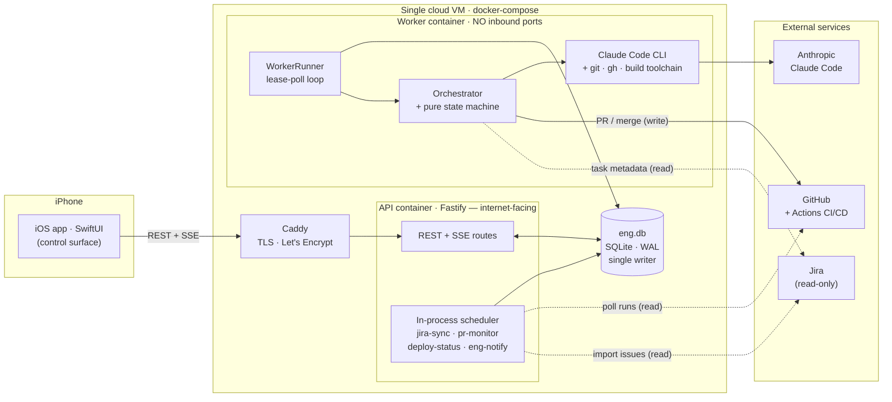

# LoopKeeper — Engineering Pipeline & Claude Code Technical Architecture

> **Scope:** the engineering delivery pipeline (`plan → dev → test → pr → review → merge → deploy → verify → rollback`) and, as its centerpiece, **how LoopKeeper uses Claude Code**. This is the companion architecture document the PRD references (`LoopKeeper-Engineering-PRD.md:6`, `:231`) but does not itself contain.
>
> **Out of scope:** the product "open-loops" reminder pipeline (Slack/Gmail → the raw Anthropic Messages API). That subsystem does **not** use Claude Code — see the boundary note in §1.
>
> Every claim below is anchored to `path:line` in the repo so this document stays verifiable as the code evolves (see §11).

## Contents

1. [Overview & boundaries](#1-overview--boundaries)
2. [System architecture](#2-system-architecture)
3. [The pipeline stages](#3-the-pipeline-stages)
4. [The state machine](#4-the-state-machine)
5. [Execution model](#5-execution-model)
6. [How LoopKeeper uses Claude Code](#6-how-loopkeeper-uses-claude-code) — *centerpiece*
7. [Data model](#7-data-model)
8. [Live activity streaming](#8-live-activity-streaming)
9. [CI/CD & the deploy-observer](#9-cicd--the-deploy-observer)
10. [Safety model (summary)](#10-safety-model-summary)
11. [Appendix — source map](#11-appendix--source-map)

---

## 1. Overview & boundaries

The engineering pipeline is a **single-user, phone-first software delivery system**. There is exactly one operator (the assignee); the iOS app is not a dashboard but the *control surface* — every consequential decision is a tap on the phone, and everything between those taps is done by an autonomous coding agent running on a cloud VM. That agent is **Claude Code, Anthropic's CLI coding agent**, invoked headless. It does the mechanical engineering work end to end: it reads the Jira issue, writes an approvable plan, implements the change on an isolated git worktree, runs the test suite and fixes its own failures, opens the pull request, addresses review comments, and — after a merge it is never allowed to perform itself — watches CI/CD and fixes-forward a broken build. The human owns the *decisions that matter* (which plan ships, whether to open the PR, whether to merge, whether the deploy is good, whether to roll back); Claude Code owns the *labor*.

A task moves through nine stages — `plan → dev → test → pr → review → merge → deploy → verify → rollback` (`backend/src/domain/eng-task.ts:28`). The PRD frames the core lifecycle as seven stages with three mandatory approval gates; `verify` and `rollback` are the post-deploy additions this architecture layers on top (`backend/src/domain/eng-task.ts:42-47`).

**Boundary — one important distinction.** LoopKeeper contains *two* LLM pipelines, and this document covers only one of them. The original product surface — the open-loops extractor that reads Slack/Gmail and generates reminders — talks to the **raw Anthropic Messages API SDK** via an injectable `ExtractionClient` (`AnthropicExtractionClient`, `backend/README.md:18-20`), forcing a structured tool call. It does **not** use Claude Code. The engineering pipeline described here is the *opposite* end of the spectrum: a full agentic CLI with filesystem, git, and shell access. Keeping these two provider integrations cleanly separated — a thin metered API call for classification, a sandboxed autonomous agent for code — is itself a deliberate design line, not an accident of history.

This document is the companion architecture doc that the PRD references (`LoopKeeper-Engineering-PRD.md:6` and `:231`); it fills in the cloud-machine setup, Claude Code orchestration, worktree/session lifecycle, live streaming, CD-observer, and the safety model that the PRD points to but does not specify.

---

## 2. System architecture

The system is four cooperating pieces plus a set of external services, and the single most important structural decision is the **api/worker process split**.



The **iOS app** speaks two protocols to the backend: plain REST for reads and gate actions, and a long-lived **Server-Sent Events** stream for live activity (`GET /tasks/:id/stream`, `backend/src/server/routes/engineering.ts:208`). It never touches Jira, GitHub, or Claude directly — the phone only ever talks to LoopKeeper's own API.

The **Fastify API** (the `loopkeeper` service in compose) is the only internet-facing process. It sits behind **Caddy**, which terminates TLS and auto-issues a Let's Encrypt certificate; the API itself only `expose`s port 8080 on the internal compose network and is never published to the host (`deploy/docker-compose.yml:15-16`, `:36-49`). Beyond serving REST/SSE, the API hosts an **in-process scheduler** that runs the pipeline's observers and notifier — `PrMonitor`, `DeployMonitor`, and `EngNotifier` each "runs as an api-side scheduler job" (`backend/src/engineering/pr-monitor.ts:20`, `backend/src/engineering/deploy-monitor.ts:24`, `backend/src/engineering/eng-notify.ts:40`). These poll GitHub and push APNs notifications, but they only *read* external state and *write* the local DB — they hold no coding-agent capability.

The **Worker container** (`worker`, built from `Dockerfile.worker`) is where all the dangerous capability lives: the Claude Code CLI, `git`/`gh`, and the build toolchain. Critically, it has **no inbound ports** (`deploy/docker-compose.yml:18-20`). It is a pure consumer of the job queue — it reaches *out* to GitHub and Anthropic but nothing can reach *in*. It mounts two extra volumes the API does not: `lk_workspace` for the mirror clone and per-task git worktrees, and `lk_claude` (`/root/.claude`) so Claude Code session state survives restarts (`deploy/docker-compose.yml:29-32`).

The two processes rendezvous through **`eng.db`, a shared SQLite database** on the `lk_data` volume, opened by both in WAL mode with a `busy_timeout` (`backend/src/store/eng-store.ts:254-255`). SQLite's single-writer discipline plus the timeout serializes the API and the worker without a separate database server, and every state change funnels through one compare-and-swap chokepoint — `EngStore.transition()` (`backend/src/store/eng-store.ts:642`) — so there is exactly one place where the state machine's rules are enforced. This is the classic "share a database, not a service" pattern, and it is the right call for a single-user system: no message broker, no RPC, crash-safe, and trivially inspectable.

**Why the split matters (the showcase point):** the internet-facing service must never hold the Claude subscription token, the GitHub write token, or the deploy key, and it must never be one `spawn()` away from arbitrary code execution. By moving Claude Code, `gh`, and secrets into a portless worker and letting the two processes communicate only through a leased SQLite queue, a compromise of the public API yields no agent capability and no credentials, and a bug in agent code cannot take down the API that the operator's phone depends on. The blast radius of each half is bounded independently.

The external services are **Jira (read-only)** — the source of truth for task metadata, never written back with engineering state — **GitHub + GitHub Actions** for PRs and CI/CD, and the **Claude Code CLI** invoked headless by the worker.

---

## 3. The pipeline stages

LoopKeeper models an engineering task as a position in a **9-stage lifecycle** (`STAGES`, `backend/src/domain/eng-task.ts:28`): `plan → dev → test → pr → review → merge → deploy → verify → rollback`. Stage and status are two independent columns, each drawn from a per-stage `as const` literal union (`eng-task.ts:35-47`) — no `enum`, so the exact tokens are a frozen wire contract shared by the SQLite columns, the iOS decoder, and the pure state machine (`eng-task.ts:12-14`). Statuses like `pr:creating`, `merge:merging`, and `deploy:deploying` are **transient CAS-guard states**: a gate route compare-and-swaps *into* them before the worker performs the irreversible external action, so a crash mid-action is always recoverable to a known point (`eng-task.ts:31-33`).

Each stage is advanced by a worker **job** (`JOB_KINDS`, `eng-task.ts:98`) dispatched by `Orchestrator.runJob` (`orchestrator.ts:60`). Note the deliberate asymmetry: `dev` and `test` share one `dev_test` job (they form a tight fix-loop, so splitting them would just add queue round-trips), while `verify` and `rollback` each own a job because each is an independently retriable external operation.

| Stage | Statuses (enum values) | Job kind | Handler (orchestrator) | What Claude / the system does |
|---|---|---|---|---|
| `plan` | `not_started`, `in_progress`, `completed_unapproved`, `approved` | `plan` | `#handlePlan` (`orchestrator.ts:129`) | Ensures worktree + **fresh** Claude session (`randomUUID`, never `--session-id`-collides, `orchestrator.ts:136`); runs Claude in `plan` mode; stores plan markdown; then the plan-judge side-run. Stops at `completed_unapproved` (**Gate 1**). |
| `dev` | `in_progress`, `done` | `dev_test` | `#handleDevTest` (`orchestrator.ts:174`) | Resumes the plan's session (`resume:true`, cold-starts from branch log if the session is gone, `orchestrator.ts:194`); Claude implements in `execute` mode; commits + pushes; records files changed. |
| `test` | `in_progress`, `passed`, `failed` | `dev_test` (same loop) | `#handleDevTest` (`orchestrator.ts:221-247`) | Runs the `Tester` port; on `passed` runs the AC-check side-run then proposes the PR; on `failed` loops back to `dev:in_progress` if budget remains, else escalates to `blocked`. |
| `pr` | `proposed`, `creating`, `created` | `create_pr` | `#handleCreatePr` (`orchestrator.ts:250`) | Builds a clean rendered PR body (`#proposePr`, `orchestrator.ts:565`), pushes, opens (or reuses) the GitHub PR. Waits at `proposed` (**Gate 2**); on approval CAS→`creating`→`created`→`review:awaiting_review`. |
| `review` | `awaiting_review`, `comments_received`, `comments_addressed`, `approved` | `address_comments` | `#handleAddressComments` (`orchestrator.ts:276`) | On new comments (found by the `pr-monitor` poller), Claude resumes the session and addresses them, commits, re-requests review (`comments_addressed → awaiting_review`, `orchestrator.ts:316-317`). |
| `merge` | `ready`, `merging`, `merged` | `merge` | `#handleMerge` (`orchestrator.ts:320`) | Waits at `ready` (**Gate 3**); on approval CAS→`merging`, then merges the PR (squash default) via the `GithubPort`, records commit sha. |
| `deploy` | `deploying`, `deployed`, `failed` | `deploy` | `#handleDeploy` (`orchestrator.ts:336`) | In `github-actions` mode: records the merge sha, marks `deploying`, and **only observes** — the `deploy-status` poller finalizes `deployed`/`failed` (no deploy key on the worker, `orchestrator.ts:340-351`). `ssh` mode redeploys directly (`orchestrator.ts:354-363`). |
| `verify` | `in_progress`, `awaiting_review`, `verified`, `failed` | `verify` | `#handleVerify` (`orchestrator.ts:367`) | Smoke-checks the prod URL (`fetch` with a 10 s timeout) + bundles a change summary; `awaiting_review` on health-OK, else `failed`. Waits for sign-off (**Gate 4**). `verify:verified` is a **success terminal**. |
| `rollback` | `ready`, `in_progress`, `rolled_back`, `failed` | `rollback` | `#handleRollback` (`orchestrator.ts:399`) | Waits at `ready` (**Gate 5**); on approval reverts the merge on a fresh branch, opens + merges a revert PR (CD redeploys the good state). `rollback:rolled_back` is a **recovered terminal**. |

**Two advisory side-runs** are inlined into the `dev_test` job — neither is a queue stage, neither can block the pipeline:

- **AC-check (LP-33)** — `#runAcCheck` (`orchestrator.ts:496`), fired between `test:passed` and `pr:proposed` (`orchestrator.ts:233`). A **fresh** Claude session (never resumes, never mutates `claudeSessionId`) seeded with the branch diff + acceptance criteria; parses a JSON array of `{criterion, pass, evidence}` into `artifacts.acCheck`. It bills iterations + USD to the budget and **never throws** — a malformed response stores `[]` rather than blocking the PR (`orchestrator.ts:542-560`).
- **Plan-judge (LP-101)** — `#runPlanJudge` (`orchestrator.ts:445`), fired after a plan is generated (`orchestrator.ts:163`). A cheap fresh **Haiku** run (`claude-haiku-4-5-20251001`, `orchestrator.ts:460`) returns a clamped `[0,1]` `qualityScore` attached to the plan artifact; wrapped in `try/catch`, it degrades to `null` on any failure so the plan flow is unchanged.

**Cross-cutting states** reachable from any active stage (`TASK_STATUSES`, `eng-task.ts:55`): `blocked` (budget/iteration exhausted or a thrown job — an escalation, recoverable by raising the cap and retrying) and `cancelled` (user abandon — terminal). Both **keep the stage** they occurred in so a later retry resumes the right place.

---

## 4. The state machine

The engineering FSM (`backend/src/engineering/state-machine.ts`) is **pure — no I/O** (`state-machine.ts:2`). It answers three questions and nothing else: *is this transition legal for this actor* (`canTransition`, `:100`), *does it cross a gate* (`transitionNeedsGate`, `:92`), and *what should happen next* (`effectsFor`, `:198`). Persistence and side effects live entirely in `EngStore` and the orchestrator. That separation is what makes the whole lifecycle unit-testable with fakes and keeps the safety rules in one auditable place.

The complete transition graph (`ALLOWED_TRANSITIONS`, `state-machine.ts:22-53`) — the linear happy-path spine, the three cycles, and the five human gates (⛬) — is:

```mermaid
stateDiagram-v2
    direction TB
    [*] --> planNotStarted : jira-sync import

    planNotStarted   : plan · not_started
    planInProgress   : plan · in_progress
    planUnapproved   : plan · completed_unapproved
    planApproved     : plan · approved
    devInProgress    : dev · in_progress
    devDone          : dev · done
    testInProgress   : test · in_progress
    testPassed       : test · passed
    testFailed       : test · failed
    prProposed       : pr · proposed
    prCreating       : pr · creating
    prCreated        : pr · created
    reviewAwaiting   : review · awaiting_review
    reviewComments   : review · comments_received
    reviewAddressed  : review · comments_addressed
    reviewApproved   : review · approved
    mergeReady       : merge · ready
    mergeMerging     : merge · merging
    mergeMerged      : merge · merged
    deployDeploying  : deploy · deploying
    deployDeployed   : deploy · deployed
    deployFailed     : deploy · failed
    verifyInProgress : verify · in_progress
    verifyAwaiting   : verify · awaiting_review
    verifyVerified   : verify · verified
    verifyFailed     : verify · failed
    rollbackReady    : rollback · ready
    rollbackRunning  : rollback · in_progress
    rollbackDone     : rollback · rolled_back
    rollbackFailed   : rollback · failed

    planNotStarted --> planInProgress : Prepare Plan (user)
    planInProgress --> planUnapproved : agent plan done
    planUnapproved --> planInProgress : revise
    planUnapproved --> planApproved : ⛬ GATE 1 (user)
    planApproved --> devInProgress

    devInProgress --> devDone
    devDone --> testInProgress
    testInProgress --> testPassed
    testInProgress --> testFailed
    testFailed --> devInProgress : fix loop (budget-gated)
    testPassed --> prProposed

    prProposed --> prCreating : ⛬ GATE 2 (user)
    prCreating --> prCreated
    prCreated --> reviewAwaiting
    reviewAwaiting --> reviewComments
    reviewAwaiting --> reviewApproved
    reviewComments --> reviewAddressed
    reviewAddressed --> reviewAwaiting : re-review loop
    reviewAddressed --> reviewApproved
    reviewApproved --> mergeReady

    mergeReady --> mergeMerging : ⛬ GATE 3 (user)
    mergeMerging --> mergeMerged
    mergeMerged --> deployDeploying
    deployDeploying --> deployDeployed
    deployDeploying --> deployFailed
    deployFailed --> deployDeploying : cd_infra re-run
    deployFailed --> devInProgress : ci_build fix-forward
    deployFailed --> rollbackReady
    deployDeployed --> verifyInProgress

    verifyInProgress --> verifyAwaiting
    verifyInProgress --> verifyFailed
    verifyAwaiting --> verifyVerified : ⛬ GATE 4 (user)
    verifyAwaiting --> rollbackReady
    verifyFailed --> verifyInProgress : retry smoke
    verifyFailed --> rollbackReady
    verifyVerified --> [*] : success terminal

    rollbackReady --> rollbackRunning : ⛬ GATE 5 (user)
    rollbackRunning --> rollbackDone
    rollbackRunning --> rollbackFailed
    rollbackFailed --> rollbackRunning : retry
    rollbackFailed --> rollbackReady
    rollbackDone --> [*] : recovered terminal
```



> *Cross-cutting (omitted from the graph for legibility):* from any active position an over-budget/thrown task escalates to `blocked` (`actor:"system"`, keeps its stage, recoverable), and a user may `cancel` (terminal). See §10.

**The happy path** is the linear spine of `ALLOWED_TRANSITIONS` (`state-machine.ts:22-53`): `plan:not_started → in_progress → completed_unapproved → approved → dev:in_progress → done → test:in_progress → passed → pr:proposed → creating → created → review:awaiting_review → approved → merge:ready → merging → merged → deploy:deploying → deployed → verify:in_progress → awaiting_review → verified`.

**Three cycles** branch off that spine:

- **Test-failure fix loop** — `test:failed → dev:in_progress` (`state-machine.ts:30`). The orchestrator loops in-process inside `#handleDevTest`, so each failure re-enters dev without a queue hop (`orchestrator.ts:239-246`).
- **Review loop** — `review:comments_addressed → review:awaiting_review` (`state-machine.ts:37`), driven by the `pr-monitor` poller pushing `awaiting_review → comments_received` when GitHub returns new comments.
- **Deploy-failure fan-out** — `deploy:failed` has **three** legal exits (`state-machine.ts:43`), each mapped to a distinct `failureKind` on the deploy artifact: `deploy:deploying` (a `cd_infra` transient — the retry route re-runs the *failed workflow jobs* then re-observes, and refuses unless `hasGatedMerge` proves a recorded merge approval, `routes/engineering.ts:606-624`); `dev:in_progress` (a `ci_build` fix-forward — re-enters `dev_test` with `{seedFix:true}` so iteration 1 is a build-fix seeded with the CI error, not a re-implementation, `routes/engineering.ts:574-576`, `orchestrator.ts:184`); or `rollback:ready` (undo a bad deploy).

**The exact 5 gated transitions** (`GATED_TRANSITIONS`, `state-machine.ts:56-62`) — the only edges a human tap may cross:

1. `plan:completed_unapproved -> plan:approved` (Gate 1 — approve the plan)
2. `pr:proposed -> pr:creating` (Gate 2 — authorize opening the PR)
3. `merge:ready -> merge:merging` (Gate 3 — authorize the merge)
4. `verify:awaiting_review -> verify:verified` (Gate 4 — confirm the deploy is good)
5. `rollback:ready -> rollback:in_progress` (Gate 5 — confirm the revert + redeploy)

**Effects are intents, not actions.** `effectsFor(to)` returns descriptors — `{kind:"enqueue_job"}` or `{kind:"notify"}` (`state-machine.ts:170-202`) — and the machine never touches a queue or a push socket. The orchestrator's `applyTransition` wrapper interprets them: after a *changed* transition it enqueues each `enqueue_job` effect (`orchestrator.ts:34-40`); `notify` effects are drained out-of-band by the `eng-notify` scheduler job. This is what makes the pipeline **self-chaining** — e.g. reaching `merge:merged` carries the effect `{enqueue_job:"deploy"}` (`state-machine.ts:184`), so a completed merge automatically queues the deploy without any handler knowing about the next stage.

**Budget guards are the *only* thing gating the retry edges** (`state-machine.ts:204`). Three pure predicates read a `BudgetView` and return a bool: `shouldRetryAfterTestFailure` and `shouldRetryAfterBuildFailure` (`iterationsUsed < maxIterations && usdCentsUsed < maxUsdCents`, `:216`/`:226`) and `shouldRetryReview` (`reviewRoundsUsed < maxReviewRounds && usdCentsUsed < maxUsdCents`, `:221`). `DEFAULT_BUDGET` (`eng-task.ts:301`) is **6 iterations, 500 USD-cents ($5.00), 5 review rounds**. When a guard returns false the orchestrator parks the task at `blocked` instead of spending more (`orchestrator.ts:242-245`) — so a stuck agent burns a bounded budget, never an unbounded one, and a `cancelled` or over-budget task never push-storms.

**The `EngStore.transition` chokepoint** (`store/eng-store.ts:642-686`) is the single path every state change flows through — gate routes and orchestrator advances alike. It executes five steps in order:

1. **Idempotent no-op** — re-applying the current position returns `{ok:true, changed:false}` with no event (`:645`), so a redelivered job is harmless.
2. **Validate against the pure machine** — `canTransition(cur, to, actor)`; illegal edges are rejected (`:647`).
3. **Gate re-check** — if `transitionNeedsGate` and `args.gateApproved !== true`, reject (`:649-651`). This is a *second* independent check on top of the FSM's actor check.
4. **Guarded CAS** — `UPDATE eng_tasks SET stage=?, status=? WHERE id=? AND stage=? AND status=?`; if `res.changes !== 1` a concurrent writer won the race and the whole thing aborts (`:654-657`, `:685`).
5. **Immutable audit + emit** — inside the same DB transaction it appends an `eng_events` row (from/to/actor/note + `gate_approved` marker, `:658-674`) and, on success, fires `transitionEmitter.emit("transition", …)` (`:683`) which backs the live SSE activity stream.

**The safety invariant** — *"the agent never authors AND merges without a human in between"* (`state-machine.ts:9`) — is enforced **in both layers, redundantly by design**. The pure FSM makes it *impossible to express* an agent gate crossing: `canTransition` returns `{ok:false}` for any gated edge where `actor !== "user"` (`state-machine.ts:135-137`). The store then *independently* requires `gateApproved === true` (`eng-store.ts:649`), a flag only the human-tap gate routes set (`routes/engineering.ts:391,430,487,506,548`). Neither layer trusts route discipline, and neither trusts the other — an agent- or system-driven transition literally cannot carry both `actor:"user"` and a genuine `gateApproved`, and the audit row's `gate_approved` column preserves the proof for the deploy-retry invariant (`hasGatedMerge`, `eng-store.ts:689`).

---

## 5. Execution model

The pipeline runs on a **single worker process** (`backend/src/worker/worker.ts`) in its own container with `git`/`gh`/`claude` + the build toolchain, sharing `eng.db` with the API as the **single writer at concurrency 1** (`worker/worker.ts:2-6`). On boot it `loadConfig`s, opens the store, `recover()`s, and `start()`s the poll loop with `keepAlive:true` (`worker/worker.ts:11-21`).

**The poll loop.** `WorkerRunner.start(pollMs)` runs `#drain` on an interval (default **15 s**, `config.workerPollEverySec`, `config.ts:244`), guarded by a `#busy` flag so ticks never overlap (`worker.ts:78-92`). `#drain` calls `tick()` up to 100 times until the queue is momentarily empty — sequential, concurrency 1 (`worker.ts:94-99`). One `tick()` (`worker.ts:41`) is deliberately deterministic and does exactly one unit of work:

1. `reapExpiredLeases(now)` — reclaim dead work.
2. `claimNext(...)` — atomically lease the oldest ready job.
3. `markJobRunning`, then `orchestrator.runJob(job)`.
4. On success `completeJob`; on a thrown error `failJob` **and** `orchestrator.escalate` the task to `blocked` — unless a cancel is pending, in which case escalation is skipped (`worker.ts:61-73`).

**The lease-based durable queue** lives in `eng_jobs`. `claimNext` is a single atomic SQL statement — `UPDATE … SET state='claimed', lease_until=?, attempts=attempts+1 WHERE id = (SELECT … WHERE state='queued' AND available_at <= ? ORDER BY created_ts ASC LIMIT 1) RETURNING *` (`eng-store.ts:822-834`) — so claiming is race-free even across processes. Three properties make it durable:

- **Dedupe** — `enqueue` catches the `UNIQUE constraint` violation on a **partial index** over `dedupe_key WHERE state IN ('queued','claimed','running')` (`eng-store.ts:325-327,816`) and returns `null`. So a live `{taskId}:{kind}` job blocks duplicates, but once it's `done` a fresh one can be queued — exactly the semantics an idempotent retry route needs (`routes/engineering.ts:447,522,622`).
- **Orphan recovery** — `recover()` on restart calls `reapExpiredLeases` (claimed/running jobs past their `lease_until` go back to `queued`, or `failed` if attempts are exhausted, `eng-store.ts:863-877`) and `reconcileRunningAgentRuns` (aborts orphaned agent runs). A crash mid-job self-heals on the next boot.
- **Cancel via process-group kill** — the cancel route sets a `cancel_pending` flag and drains queued jobs (`routes/engineering.ts:643-645`). While a job runs, the worker's cancel-watcher polls `isTaskCancelPending` every **1.5 s** and invokes the kill callback the orchestrator registered (`worker.ts:49-59`). Because the Claude/git/gh child is spawned `detached` with its own process group, the callback sends `SIGTERM` to `-pid` then `SIGKILL` after 5 s — killing the whole subprocess tree, not just the top shell (`engineering/adapters/spawn.ts:37-47`).

**Effect-driven chaining between stages** is how the pipeline advances without a central conductor: each transition's `enqueue_job` effect queues the *next* stage's job (`orchestrator.ts:34-40`), so `plan:approved`→`dev_test`, `merge:merged`→`deploy`, `deploy:deployed`→`verify` all self-sequence (`state-machine.ts:178,184,186`). Human gates break the chain deliberately — the gate route CAS-es into the transient state and enqueues the follow-on job itself, carrying a payload the effect can't (e.g. the merge `method`, `routes/engineering.ts:487-489`).

**The API-side interval Scheduler** (`scheduler/scheduler.ts`, wired in `server/app.ts:181-252`) runs the polling that the worker doesn't. Each job is isolated — a throwing job is logged and the others still run (`scheduler.ts:42-48`), so an unconfigured connector never takes the server down:

| Job | Cadence | Purpose |
|---|---|---|
| `jira-sync` | `jiraSyncEveryMin`, default **10 min** (`config.ts:242`) | Import assigned Jira issues + reconcile stale rows (`app.ts:215-222`). |
| `pr-monitor` | `prPollEveryMin`, default **5 min** (`config.ts:243`) | Poll open PRs for review comments/approval → drive the review loop (`app.ts:224-231`). |
| `deploy-status` | `prPollEveryMin`, default **5 min** (`app.ts:234-242`) | In `github-actions` mode, observe the CD run and finalize `deploy:deployed`/`failed`. |
| `eng-notify` | hardcoded **60 s** (`app.ts:244-251`) | Push when a task needs a human (plan/PR/merge ready, comments, deploy failed, blocked). |

**Everything Jira/GitHub is *polled* — there are no webhooks.** Review comments, PR approval, and CD status are all discovered by the schedulers above on a fixed cadence, and deploy in `github-actions` mode is observe-only (the worker holds no deploy key, `orchestrator.ts:340-351`). The design trade is explicit: polling means no public webhook endpoint to secure and no missed-delivery reconciliation, at the cost of up-to-5-minute latency on inbound events — a sound choice for a single-user, single-repo dogfood system. Combined with **worker concurrency 1** as the single writer to `eng.db`, the whole system needs no distributed locking: the queue serializes work, the CAS-guarded `transition` serializes state, and the leases + partial-unique dedupe make every operation safe to retry.

---

## 6. How LoopKeeper uses Claude Code

LoopKeeper drives Claude Code as a **headless subprocess**, one invocation per pipeline stage, through a single adapter (`backend/src/engineering/adapters/claude-runner.ts`). There is no Agent SDK, no long-lived agent process, and no MCP layer: the orchestrator is plain TypeScript that owns the state machine, and Claude Code is invoked only to do the two things a language model is uniquely good at — *planning* a change and *writing* the code. Everything irreversible (commit, push, PR, merge, deploy) is done deterministically by the orchestrator over typed ports, never by the agent. This section shows exactly how the CLI is called and, more importantly, why each choice is the right one for an autonomous-but-safe pipeline.

### The invocation

Every stage assembles the same argv skeleton in `#invoke` (`claude-runner.ts:57-64`) and spawns it with no shell (`spawn.ts:31-33`), so the prompt can never be interpreted as shell:

```
claude -p --output-format stream-json --verbose \
  (--session-id <uuid> | --resume <uuid>) \
  --permission-mode (plan | acceptEdits) \
  [--model <model>] \
  "<prompt>"
```

| Flag | Value | Why |
|---|---|---|
| `-p` | (headless) | Non-interactive print mode — the CLI runs to completion and exits, which is what a job worker needs. |
| `--output-format stream-json` | | Emits one JSON event per line so the runner can parse tool calls, the plan, cost and turns as they stream, and tee them to a transcript (`claude-runner.ts:86-89`). |
| `--verbose` | | Required for `stream-json` to include assistant/tool events, not just the final result. |
| `--session-id <uuid>` \| `--resume <uuid>` | task session | First run **assigns** a session id up front; later stages **resume** it (`claude-runner.ts:59-60`). |
| `--permission-mode plan` \| `acceptEdits` | per stage | The safety spine — read-only planning vs. autonomous editing (`claude-runner.ts:61`). |
| `--model <m>` | optional | Only added when a model is resolved; omitted otherwise so the CLI picks its default (`claude-runner.ts:62-63`). |
| `"<prompt>"` | positional | A plain user prompt built by `prompts.ts` — no system-prompt override, no slash command (`claude-runner.ts:64`). |

The runner's header comment (`claude-runner.ts:34-39`) is the design brief in one paragraph:

> Runs Claude Code headless. Session id is ASSIGNED up front (`--session-id`) so it's crash-proof; dev/review `--resume` it, and on resume failure (cwd drift / expiry / version quirk) it cold-starts a fresh session with the plan+branch context (P0-2). `--allowedTools` is intentionally NOT passed (it broke `--resume` on CLI 2.1.158) — blast radius is bounded by the worktree cwd, a repo-scoped token, and branch protection on main. The spawn env is minimal (no prod secrets, no deploy key).

**Pinned CLI version.** The worker image installs an exact version: `ARG CLAUDE_CODE_VERSION=2.1.158` → `npm install -g @anthropic-ai/claude-code@${CLAUDE_CODE_VERSION}` (`Dockerfile.worker:4,22`). This is deliberate — the CLI is part of the pipeline's behavior contract. Pinning keeps "plan/dev/review behavior reproducible" (`Dockerfile.worker:12`) so a silent CLI upgrade can't change how plans are shaped or how `--resume` behaves, and it's why the `--allowedTools` regression could be pinned-around instead of chased.

### Feature-usage table

The interesting engineering here is as much about what is *deliberately not used* as what is. Everything below is verified against the argv builder and the adapter — the CLI surface LoopKeeper touches is intentionally small.

| Claude Code feature | Used? | Where / why |
|---|---|---|
| Headless print mode (`-p`) | ✅ | `claude-runner.ts:58` — the only way to run the CLI as a batch job. |
| `--output-format stream-json` | ✅ | `claude-runner.ts:58`; parsed line-by-line in `#consume` (`:109-139`). |
| `--verbose` | ✅ | `claude-runner.ts:58` — needed for streamed assistant/tool events. |
| Session assigned up front (`--session-id`) | ✅ | Fresh `randomUUID()` persisted **before** the run (`orchestrator.ts:136-137`), passed on first run (`claude-runner.ts:60`) — crash-proof. |
| `--resume` | ✅ | Dev/test and review runs resume the task session (`orchestrator.ts:194,291`; `claude-runner.ts:59`). |
| Cold-start fallback on resume failure | ✅ | `run()` detects a broken resume and re-invokes with a fresh session + plan/branch context (`claude-runner.ts:47-55`). |
| `--permission-mode plan` vs `acceptEdits` | ✅ | Read-only planning vs. execution (`claude-runner.ts:61`). |
| `--model` selection | ✅ | Global default, per-task override, or judge pin (`claude-runner.ts:62-63`). |
| Plan capture via `ExitPlanMode` tool_use | ✅ | Plan text is read from the tool input, not the result (`claude-runner.ts:125-128`). |
| Cost / turn accounting | ✅ | `total_cost_usd`→cents and `num_turns` from the `result` event (`claude-runner.ts:136-137`), billed to the task budget. |
| Subscription OAuth auth (`CLAUDE_CODE_OAUTH_TOKEN`) | ✅ | Preferred, so dev runs bill the subscription, not metered API (`claude-runner.ts:72`). |
| API-key fallback (`ANTHROPIC_API_KEY`) | ✅ | Used only when no OAuth token is set (`claude-runner.ts:73`). |
| `~/.claude` login (no env credential) | ✅ | If neither env var is set, the CLI uses persisted login via `HOME` (`claude-runner.ts:69`, comment `:66`); state survives restarts on the `lk_claude` volume (`docker-compose.yml:32`). |
| Transcript JSONL logging | ✅ | Every stream line is redacted and appended to `<taskId>/<stage>-<sessionId>.jsonl` (`claude-runner.ts:141-158`), which feeds the live activity feed/SSE. |
| `--allowedTools` | ❌ | Broke `--resume` on 2.1.158 (`claude-runner.ts:37`); blast radius is bounded by cwd, token scope, branch protection, and minimal env instead. |
| `--dangerously-skip-permissions` | ❌ | Never — `acceptEdits` already gives headless autonomy without disabling the permission model; ship actions are gated elsewhere. |
| MCP servers | ❌ | No `.mcp.json`/`--mcp-config` (repo has none); the agent's world is the worktree + `git`/`gh` CLIs, keeping the tool surface auditable. |
| Subagents / `--agents` | ❌ | One flat agent per stage; orchestration is the TypeScript state machine, not nested agents. |
| Hooks | ❌ | Lifecycle control is external (spawn + orchestrator), not in-CLI hooks. |
| Slash commands | ❌ | Prompts are built programmatically in `prompts.ts`, never interactive commands. |
| `--append-system-prompt` / custom system prompt | ❌ | Every prompt is a plain positional user prompt (`claude-runner.ts:64`); behavior lives in the prompt text, not a hidden system layer. |
| `CLAUDE.md` | ❌ | The target worktree carries no `CLAUDE.md`, so runs are fully specified by the rendered prompt — no implicit repo-memory that could drift between stages. |
| Agent SDK (`query()` / `ClaudeSDKClient`) | ❌ | Raw CLI subprocess only (`spawn.ts`), so the exact argv, env, and process group are under LoopKeeper's control (needed for the minimal-env and process-group-kill guarantees). |

### Per-stage agent runs

Each pipeline stage picks a prompt template, a permission mode, a session strategy, and a model. Note the two "throwaway" runs — AC-check and plan-judge — deliberately use fresh sessions that are **not** written back as the task session, so an advisory run can never corrupt the resume chain.

| Stage / run | Prompt template | Permission mode | Session | Model |
|---|---|---|---|---|
| Plan | `renderPlanPrompt` (`prompts.ts:11`) | `plan` (read-only) | Fresh `randomUUID`, `resume:false` (`orchestrator.ts:136-141`) | `task.claudeModel` → global default |
| Dev / test loop (first iter) | `renderDevPrompt` (`prompts.ts:22`) | `acceptEdits` | Resume task session (`orchestrator.ts:194`) | `task.claudeModel` |
| Fix (test failure) | `renderFixPrompt` (`prompts.ts:32`) | `acceptEdits` | Resume | `task.claudeModel` |
| Build-fix (post-merge CI red) | `renderBuildFixPrompt` (`prompts.ts:42`) | `acceptEdits` | Resume, seeded with CI error (`orchestrator.ts:184,191`) | `task.claudeModel` |
| Cold-start (resume unavailable) | `renderColdStartPrompt` (`prompts.ts:53`) | `acceptEdits` | New fresh session (`claude-runner.ts:51-52`) | `task.claudeModel` |
| Address-comments | `renderAddressCommentsPrompt` (`prompts.ts:120`) | `acceptEdits` | Resume (`orchestrator.ts:291`) | `task.claudeModel` |
| AC-check (advisory) | `renderAcCheckPrompt` (`prompts.ts:83`) | `acceptEdits` | Fresh, **not** persisted (`orchestrator.ts:510,521`) | `task.claudeModel` |
| Plan-judge (advisory) | `renderPlanJudgePrompt` (`prompts.ts:102`) | `plan` (read-only) | Fresh, **not** persisted (`orchestrator.ts:447,457`) | Hard-pinned Haiku (`orchestrator.ts:460`) |

The prompts are terse and role-specific. The plan prompt fences the agent into read-only planning:

> You are planning the implementation of a software task in the repo `${task.repo}`. Do NOT modify any files — produce a clear, reviewable implementation plan only. (`prompts.ts:13-14`)

The fix prompt guards against the classic "make the test pass by deleting the test" failure mode:

> The verification checks (typecheck, lint, and unit tests) are failing. Fix the code so they all pass — do not delete or skip tests/checks to make them pass. (`prompts.ts:34`)

And the build-fix prompt even encodes a domain hint about the most common post-merge break — a port/interface method added without updating its test doubles (`prompts.ts:45`).

### Session discipline

The session lifecycle is designed to survive crashes without losing work:

1. **Assign up front.** When planning starts, the orchestrator generates the session id, persists it to `eng.db` *before* spawning the CLI (`orchestrator.ts:136-137`), and passes it via `--session-id`. Because the id is durable state, a worker crash mid-run leaves a well-known session to reconnect to rather than an anonymous, lost conversation.
2. **Resume on dev/review.** Dev, fix, and address-comments runs pass `resume:true` with the stored id (`orchestrator.ts:194,291`) so the agent keeps the plan and prior edits in context across stages — no re-explaining the task each iteration.
3. **Cold-start fallback.** If resume fails — cwd drift, session expiry, or a CLI-version quirk — `run()` matches the error (`/No conversation found|…|session/i`), mints a fresh id, and re-invokes with the **cold-start prompt** (`claude-runner.ts:47-55`). That prompt re-injects the approved plan plus the branch commit log and instructs "Do not redo or revert work already committed on this branch" (`prompts.ts:53-67`). The new session id is then persisted so subsequent stages resume the *recovered* session (`orchestrator.ts:207-210`).

The worktree is the anchor that makes this robust: it is the task's immutable cwd for its whole life (`ports.ts:29`, `eng-task.ts:337-338`). Even a total session loss degrades to "here is the plan and here is what's already committed — continue," never to lost work.

### Permission modes as the safety spine

`--permission-mode` is the mechanism that lets the agent be autonomous without being dangerous, and it maps cleanly onto the human gates:

- **`plan` mode** is read-only. The plan and judge runs use it (`orchestrator.ts:141,457`). In plan mode the model can't edit files, and it delivers its plan through the `ExitPlanMode` **tool call**, which the runner captures from `tool_use.input.plan` rather than from the final `result` (`claude-runner.ts:24,125-128`). A human then approves that plan at the plan gate (`engineering.ts:373-394`) before any code is written.
- **`acceptEdits` mode** is execution: the agent edits files in its worktree without a per-edit prompt, which is what makes headless dev possible (`claude-runner.ts:61`).

The key insight is that `acceptEdits` only grants *file-editing* autonomy. The agent never opens a PR, merges, or deploys — those are orchestrator effects executed over typed ports (`workspace.commitAndPush`, `RestGithubClient.merge`) and each is guarded by a compare-and-swap gate that only a `user` actor with `gateApproved` can cross: PR creation (`engineering.ts:418-433`) and merge (`engineering.ts:472-491`). So the pipeline structurally prevents the same actor from both **authoring** and **shipping** — the agent writes, a person approves the PR-open and the merge. Autonomy where it's cheap to undo (edits on a branch), a human on every irreversible step.

### Output handling

The runner treats the CLI's stdout as an event stream and reduces it into a small typed result (`StreamResult`, `claude-runner.ts:21-32`). Parsing is defensive: non-JSON partial lines are ignored (`claude-runner.ts:115-116`) so a stray log line never crashes a run.

**Success rule** (`claude-runner.ts:95`) — a run is `ok` only if all four hold:

```ts
const ok = proc.code === 0 && !proc.timedOut && !parsed.isError && parsed.sawResult;
```

Requiring `sawResult` means a process that exits 0 but never emitted a terminal `result` event (e.g. killed after partial output) is correctly treated as a failure, not a silent success.

**Final-text precedence** (`claude-runner.ts:94`) — `result` text, else the captured `ExitPlanMode` plan, else the last assistant text:

```ts
const finalText = parsed.finalText || parsed.planText || parsed.lastAssistantText;
```

This single rule lets one code path serve both plan runs (where the payload arrives via `ExitPlanMode`) and execute runs (where it arrives in `result`), with a last-assistant-text safety net for change summaries.

**JSON consumers are tolerant.** The two advisory runs ask for structured output and parse it without ever letting a malformed response break the pipeline:

- **AC-check** expects a JSON *array* of `{criterion, pass, evidence}`; it filters to objects, coerces fields, redacts each `evidence` string, and on any parse error stores `[]` rather than throwing (`orchestrator.ts:542-560`).
- **Plan-judge** expects a JSON *object* `{score, reasons}`; it reads `score`, rejects non-finite values, and clamps to `[0,1]` (`orchestrator.ts:481-488`).

**Redaction is applied on the boundary, always.** Every returned `finalText` and error is passed through `redactSecrets` (`claude-runner.ts:99,105`), and every transcript line is redacted before it hits disk (`claude-runner.ts:154`). Secrets can't leak into the DB, the PR body, the activity feed, or a log file.

### Model policy

Model selection is layered, with the API surface enforcing an allow-list:

- **Global default is `null`** — `ENG_CLAUDE_MODEL` unset means the runner omits `--model` and lets the CLI choose (`config.ts:188`, `claude-runner.ts:62-63`). This avoids hard-coding a model id that ages out.
- **Per-task override** via `PATCH /tasks/:id` with `{claudeModel}` (`engineering.ts:337-352`), stored on the task (`eng-task.ts:342`) and threaded into every run for that task (`orchestrator.ts:141,194`).
- **Allow-list enforced** — only `claude-opus-4-8`, `claude-sonnet-4-6`, `claude-haiku-4-5-20251001` are accepted; anything else (e.g. `gpt-4o`) returns HTTP 400 (`engineering.ts:335,346-347`). The pipeline is Claude-only by construction, so a typo or a wrong-provider id can't reach the CLI.
- **Judge hard-pinned to Haiku** — the plan-quality judge always runs `claude-haiku-4-5-20251001` regardless of the task's model (`orchestrator.ts:460`), because it's a cheap advisory score that shouldn't consume Opus/Sonnet budget.

### LLM-as-judge & AC-check

Both extra Claude runs are **best-effort and non-blocking by design** — the pipeline advances whether or not they succeed:

- **Plan-judge (LP-101)** scores the plan on coverage / localization / scope-fit and returns a clamped `[0,1]` or `null`. It's invoked inside a `try/catch` that swallows any exception so "the plan flow continues unchanged" (`orchestrator.ts:161-169`), and `#runPlanJudge` itself catches spawn errors and returns `null` (`orchestrator.ts:462-465`). The score is surfaced *inline* in the plan-ready push — the notification title becomes `Plan ready (0.87) · LP-42` via `score.toFixed(2)` (`eng-notify.ts:12-14`), giving the reviewer a quality signal before they even open the plan.
- **AC-check (LP-33)** runs a fresh agent over the branch diff + acceptance criteria and stores per-criterion pass/fail. It "never throws — all errors are caught so `pr:proposed` always advances" (`orchestrator.ts:492-495`); a missing diff, a CLI failure, or malformed JSON all degrade to an empty result set, never a blocked task.

Both bill their cost to the task budget (`orchestrator.ts:477,540`) so advisory runs are still accounted for, and both use fresh sessions that are never persisted as the task session — an advisory run can't pollute the dev/review resume chain.

### Blast-radius & safety controls

The reason LoopKeeper can let an agent edit code unattended is defense-in-depth: several independent bounds, each cheap, so no single control is load-bearing.

| Control | Mechanism | Source |
|---|---|---|
| Minimal, non-inherited spawn env | Only `PATH`, `HOME`, one auth token, and `GH_TOKEN`/`GITHUB_TOKEN` are passed — **not** merged with `process.env`, so no prod secrets, master key, or deploy key reach the agent. | `claude-runner.ts:66-77`; `spawn.ts:12-13,35` |
| Worktree-scoped cwd | The agent runs in the task's isolated git worktree, its immutable anchor — not the repo root or the server's cwd. | `claude-runner.ts:83`; `ports.ts:29` |
| Repo-scoped GitHub token | A fine-grained PAT scoped to *only* the LoopKeeper repo (contents + PRs), explicitly "never the deploy key." | `claude-runner.ts:17`; `config.ts:117`; `loopkeeper.env.example:55` |
| Branch protection on `main` | The agent works on a task branch; nothing merges to `main` without a gated human approval and GitHub's own protection. | `claude-runner.ts:38`; gates at `engineering.ts:472-491` |
| Detached process-group kill | Cancel/timeout runs are spawned `detached`, and the worker's cancel-watcher can `SIGTERM → SIGKILL (after 5s)` the whole process **group** (`-pid`), reaping child `git`/`pnpm`/`vitest` processes too. | `spawn.ts:38-49`; `orchestrator.ts:91-95,141` |
| Per-run wall-clock timeout | 20-minute default (`ENG_RUN_TIMEOUT_MS=1200000`) hard-kills a runaway run (`SIGTERM → SIGKILL after 10s`). | `config.ts:192`; `spawn.ts:56-61` |
| No shell interpolation | Argv is always an array; the prompt is a positional arg, so it can't be interpreted as a shell command. | `spawn.ts:27-33` |
| Pinned CLI version | `claude-code@2.1.158` for reproducible behavior — no silent upgrade changes plan/dev/review semantics. | `Dockerfile.worker:4,12,22` |
| Network/process isolation of the worker | `claude`/`gh`/build toolchain live in a **separate** worker image with **no inbound ports**, kept off the internet-facing api. | `Dockerfile.worker:1-3`; `docker-compose.yml:18` |
| Persisted session state on a dedicated volume | `~/.claude` is a named volume so login/session state survives restarts without living in the app image. | `docker-compose.yml:32` |

Together these let the agent operate with real autonomy inside a tightly-drawn box: it can read and edit only its worktree, authenticate only to one repo, spend only its task budget, run only for a bounded time, and it — and its entire child process tree — can be killed on demand. The irreversible actions it can't be trusted with autonomously (merge, deploy, rollback) it simply can't perform; those stay behind human gates and the orchestrator's typed ports.

---

## 7. Data model

`eng.db` is a purpose-built database for the orchestration layer, deliberately kept *separate* from the product's `loops.db` and from Jira. Jira owns task metadata; `eng.db` owns everything about the pipeline (stage state, sessions, artifacts, budgets). Five tables carry the whole system.

| Table | Role | Key columns / notes |
|---|---|---|
| `eng_tasks` | one row per task (the aggregate) | `id` PK = `task_<sha(jiraId)>`; **`jira_id` is `UNIQUE`** (the stable identity), `jira_key` is display-only; `stage`/`status`; `artifacts` and `budget` as JSON blobs; `claude_session_id`, `claude_model`, `branch`, `worktree_path`; `cancel_pending`, `last_notified_status`, `last_error` (`backend/src/store/eng-store.ts:261-289`) |
| `eng_events` | **immutable append-only audit log** | `seq` AUTOINCREMENT PK; `from/to_stage`, `from/to_status`, `actor`, `actor_detail`, `note`, `ts`, and **`gate_approved`** — the §8 invariant marker set to 1 when a transition consumed a human approval (`backend/src/store/eng-store.ts:293-306`) |
| `eng_jobs` | the worker's **leased work queue** | `state` (`queued`/`claimed`/`running`/`done`/`failed`/`cancelled`), `attempts`/`max_attempts`, `claimed_by`, `lease_until`, `available_at`, `dedupe_key`. A **partial UNIQUE index** on `dedupe_key` *while active* prevents duplicate concurrent work for the same task/kind (`backend/src/store/eng-store.ts:325-328`) |
| `eng_agent_runs` | one row per **Claude Code headless invocation** | `session_id`, `status`, `iteration`, `usd_cents`, `num_turns`, `exit_code`, `result_summary`, and **`log_path`** — the JSONL stream that feeds the live activity feed (`backend/src/store/eng-store.ts:330-346`) |
| `eng_labels` + `eng_task_labels` | LoopKeeper-side labels (distinct from Jira's read-only labels) | many-to-many keyed by **`jira_id`** (not the row id, so labels survive key renames), `ON DELETE CASCADE` (`backend/src/store/eng-store.ts:348-361`) |

**Why identity is `jira_id`, not `jira_key`.** The row id is `task_<sha256(jiraId)>` (`backend/src/domain/eng-task.ts:434-436`) and the UNIQUE constraint is on the immutable numeric `jira_id`. When the Jira project was renamed `KAN → LP`, every issue key changed but its numeric id did not — so the pipeline's identities, worktrees, and sessions were untouched. `jira_key` is carried along purely for display.

**The `TaskArtifacts` bundle.** Rather than a wide, ever-growing column set, per-stage results are one strongly-typed JSON object stored in `eng_tasks.artifacts`. The TypeScript interface `TaskArtifacts` (`backend/src/domain/eng-task.ts:263-275`) is the *single frozen wire contract* shared by the SQLite column, the iOS decoder, and the pure state machine (`backend/src/domain/eng-task.ts:12-14`) — one schema, three consumers, no drift. It holds one nullable artifact per stage (`plan`, `dev`, `test`, `pr`, `review`, `merge`, `deploy`, `verify`, `rollback`) plus `acCheck[]` and a DRAFT-first `jiraWriteback`. Two fields worth calling out for the pipeline:

- **`plan.qualityScore`** — an advisory `[0,1]` score from an inline LLM-as-judge, `null` when the judge did not run (`backend/src/domain/eng-task.ts:119-120`); it rides along into the plan-ready push notification.
- **`deploy.failureKind`** — `ci_build | cd_infra | no_run` (`backend/src/domain/eng-task.ts:202-204`) plus a redacted `ciError` log tail, so the app can offer the *right* recovery (fix-forward vs. re-run vs. rollback) instead of a generic "deploy failed."

**Budgets** are the fourth JSON blob (`eng_tasks.budget`): `TaskBudget` with accumulating counters and the defaults `maxIterations: 6`, `maxUsdCents: 500`, `maxReviewRounds: 5` (`backend/src/domain/eng-task.ts:301-308`).

---

## 8. Live activity streaming

A live task streams two very different data planes over a **single SSE connection** at `GET /tasks/:id/stream` (`backend/src/server/routes/engineering.ts:208-314`). The route calls `reply.hijack()` (`:212`) to take raw control of the socket and writes the `text/event-stream` headers itself.

### 8.1 Stage transitions → `event: status`

`EngStore` exposes a single `transitionEmitter` (`backend/src/store/eng-store.ts:249`). Because every state change goes through the one `transition()` chokepoint, there is exactly one `emit("transition", …)` site — and it fires **only when the CAS actually changed a row** (`backend/src/store/eng-store.ts:681-683`). The stream subscribes to it (`backend/src/server/routes/engineering.ts:297`), filters to this task, and forwards each transition as a typed `event: status` carrying `{stage, status}` JSON (`:288-290`). When the task reaches a terminal position — `cancelled`, `verify:verified`, or `rollback:rolled_back` — the handler tears the stream down (`:291-295`). The phone's stage badge is thus driven by the same authoritative events the audit log records, with no polling.

### 8.2 Agent log tail → `data:` lines

The second plane is the coding agent's reasoning. Claude Code is run with `--output-format stream-json --verbose` and every line is appended to the run's per-stage JSONL log (`backend/src/engineering/adapters/claude-runner.ts:58`, `:86-87`, `:141-146`). The stream locates the latest run's `log_path`, replays the current tail on connect, then **`fs.watch`es the file** and flushes appended bytes as they arrive (`backend/src/server/routes/engineering.ts:271-277`). A byte-offset cursor advances only past the last complete `\n`, so a mid-write partial line is never emitted and multibyte characters don't desync the cursor (`:249-252`). Each raw JSONL line is passed through `formatActivityLine` (`:22-60`), which turns Claude Code's stream events into human-readable text: assistant `text` blocks, `tool_use` as `tool: <name> <first-arg-preview>` (truncated), and the final `result` as `result: ok <turns> $<cost>` or an error. System/user/malformed lines are dropped.

Operational hardening on the connection: a **15-second heartbeat comment** keeps proxies from idling the stream closed (`:285`), and cleanup listens **directly on the TCP socket's `close`** rather than on the already-ended request stream, giving the most reliable disconnect signal (`:231`, `:299-313`).

### 8.3 Legacy offset-polling fallback

`GET /tasks/:id/activity` (`backend/src/server/routes/engineering.ts:155-204`) is the pre-SSE fallback for clients that can't hold an open stream. It uses the *same* `formatActivityLine` formatter and the same complete-line, byte-length cursor logic, returning `{lines, nextOffset, done}`; a not-yet-created log (`ENOENT`) is treated as an empty read rather than an error (`:199`). Sharing the formatter between the streaming and polling paths means the two never diverge.

**iOS behavior:** the app opens the SSE stream when viewing a running task, renders the `data:` lines as a scrolling terminal-style feed, and updates the stage/status UI from each `event: status`; it closes on the terminal event and can fall back to the offset endpoint when a stream can't be held.

---

## 9. CI/CD & the deploy-observer

### 9.1 The PR gate (`ci.yml`)

On every `pull_request → main`, a single `verify` job runs `pnpm install --frozen-lockfile → pnpm -r typecheck → lint → test` on Node 22 (`.github/workflows/ci.yml:6-25`). This is the required check the **agent's auto-opened PRs must turn green** — it gives the Test stage and the merge gate real, external signal, and `main` can be configured to require it. Push-to-main verification lives separately so CI doesn't run twice on a merge (`.github/workflows/ci.yml:3-5`).

### 9.2 CD on merge (`deploy.yml` + `redeploy.sh`)

On `push → main` (i.e. a merged PR), `deploy.yml` runs `verify` and then a `deploy` job gated on `environment: production` (`.github/workflows/deploy.yml:6-8`, `:32-35`). A `concurrency` group `deploy-main` with `cancel-in-progress: false` guarantees **one deploy at a time and never cancels an in-flight one** (`:10-13`). The deploy job SSHes to the prod VM with `DEPLOY_SSH_KEY`/`USER`/`HOST` — but the VM's `authorized_keys` **pins that key to a forced command** (`ops/redeploy.sh`), so the client command is ignored and *SSH-ing in is the deploy* (`.github/workflows/deploy.yml:37-49`). `redeploy.sh` does `git fetch` + `reset --hard origin/main → docker compose up -d --build → REDEPLOY_OK <sha>`, exiting non-zero on failure (`ops/redeploy.sh:15-29`). The forced command is the key least-privilege move: a leaked deploy key can only redeploy the current `main` — it cannot run arbitrary commands (`ops/redeploy.sh:2-7`).

### 9.3 The observer, not the deployer (the key point)

LoopKeeper **does not deploy** — GitHub Actions does. LoopKeeper *observes* the run. The api-side `DeployMonitor` finds tasks in `deploy:deploying`, polls the Actions run for the merge SHA, and maps it to `deploying/deployed/failed` (`deployStatusFromRun`, `backend/src/engineering/deploy-monitor.ts:6-10`, `:40-47`). It classifies a failure as `ci_build`, `cd_infra`, or `no_run` (`:59-64`) and, **only for a `ci_build` failure**, fetches the redacted failing-job log so a fix-forward can seed the agent (`:65-69`); a timeout guard fails a run that never appears rather than spinning forever (`:49-52`). It then drives the FSM with `applyTransition(… actor: "system" …)` to `deployed`/`failed` (`:90-91`).

This decoupling is deliberate and load-bearing: because the CD run **rebuilds the worker and can restart the api itself**, an in-process deployer would be tearing down the process driving it. An idempotent, self-healing observer instead re-derives the correct state from GitHub after any restart (`backend/src/engineering/deploy-monitor.ts:20-24`). (The historical "worker SSHes and deploys" path is superseded by this GitHub-Actions mode — `.github/workflows/deploy.yml:3-5`, `ops/redeploy.sh:4-5`.)

The **`PrMonitor`** is the parallel observer for the review stage: it polls open PRs for tasks in `review:awaiting_review`/`comments_addressed`, promotes `review:approved → merge:ready` on an APPROVED decision, and raises `review:comments_received` on new unresolved comments, deduping by GitHub comment external id (`backend/src/engineering/pr-monitor.ts:33-58`). The **`EngNotifier`** sends one APNs push per *distinct* `stage:status` (deduped via `lastNotifiedStatus`, `backend/src/engineering/eng-notify.ts:59-67`), and the plan-ready notification embeds the `qualityScore` (`:11-15`).

---

## 10. Safety model (summary)

The pipeline is built so that *no consequential, irreversible action happens without an explicit human tap*, and so that a runaway or compromised agent has a small, bounded blast radius.

- **Human decision points (five; three are hard FSM gates).** The three mandatory approval gates enforced by the state machine are `plan`, `pr`, and `merge` — `GATED_STAGES` (`backend/src/domain/eng-task.ts:90`). Two further operator confirmations bracket production: the post-deploy **verify** gate (`verify:awaiting_review → verified`) and the **rollback** execution gate (`rollback:ready → in_progress`, user-gated like merge) (`backend/src/domain/eng-task.ts:42-47`).
- **"The agent never authors *and* merges without a human," enforced twice.** Defense in depth across the FSM and the store: `canTransition` rejects any gated transition unless `actor === "user"` (`backend/src/engineering/state-machine.ts:135-137`), and *independently* `transition()` refuses to apply a gated move unless `gateApproved === true` (`backend/src/store/eng-store.ts:649-651`), stamping `gate_approved = 1` into the immutable event (`:672`). Only `actor:"user"` can cross; the approval is permanently auditable.
- **Budget caps stop runaway loops.** `maxIterations: 6`, `maxUsdCents: 500`, `maxReviewRounds: 5` (`backend/src/domain/eng-task.ts:301-308`); counters accumulate in `eng_tasks.budget`. At a cap the worker escalates the task to **`blocked`** — a recoverable park, not a crash — which only `actor:"system"` can set and only a `user` can resume by raising the cap (`backend/src/engineering/state-machine.ts:114-129`). `blocked` is distinct from `test:failed` (which auto-retries), so escalation never push-storms (`backend/src/domain/eng-task.ts:49-53`).
- **Read-only Jira.** Engineering stage/status is **never** written back to Jira (`backend/src/domain/eng-task.ts:9-10`). The one exception is an opt-in advisory comment, and even that is DRAFT-first and human-approved before posting (`JiraWritebackArtifact`, `:252-261`).
- **Redaction everywhere.** Agent final text and errors are run through `redactSecrets` at capture (`backend/src/engineering/adapters/claude-runner.ts:99`, `:105`); artifact fields and the `ciError` log tail are redacted; notifications never carry secret-shaped detail (`backend/src/engineering/eng-notify.ts:6`).
- **Least privilege / minimal env.** The worker has no inbound ports (`deploy/docker-compose.yml:18-20`); Claude Code is spawned with a **minimal env** (no prod secrets, no deploy key) and `--allowedTools` deliberately omitted, with blast radius bounded instead by the worktree cwd, a repo-scoped token, and branch protection on `main` (`backend/src/engineering/adapters/claude-runner.ts:35-39`, `:66-70`); the deploy key is pinned to a forced command (`ops/redeploy.sh:2-7`); and gate auth is **assignee-only and fails CLOSED** when no self-identity is configured (`backend/src/server/routes/engineering.ts:76-81`).

---

## 11. Appendix — source map

| Concept | Source |
|---|---|
| Stage / status literal unions (9 stages) | `backend/src/domain/eng-task.ts:28`, `:58-68` |
| Gated stages (plan/pr/merge) | `backend/src/domain/eng-task.ts:90` |
| `verify` / `rollback` as added gates | `backend/src/domain/eng-task.ts:42-47` |
| `TaskArtifacts` bundle | `backend/src/domain/eng-task.ts:263-275` |
| `plan.qualityScore` (LLM-judge) | `backend/src/domain/eng-task.ts:119-120` |
| `deploy.failureKind` / `ciError` | `backend/src/domain/eng-task.ts:202-206` |
| `TaskBudget` defaults (6 / 500 / 5) | `backend/src/domain/eng-task.ts:301-308` |
| Deterministic `taskId(jiraId)` | `backend/src/domain/eng-task.ts:434-436` |
| `eng_tasks` schema (jira_id UNIQUE) | `backend/src/store/eng-store.ts:261-289` |
| `eng_events` immutable audit | `backend/src/store/eng-store.ts:293-306` |
| `eng_jobs` leased queue + dedupe index | `backend/src/store/eng-store.ts:308-328` |
| `eng_agent_runs` (session/cost/log_path) | `backend/src/store/eng-store.ts:330-346` |
| `eng_labels` / `eng_task_labels` | `backend/src/store/eng-store.ts:348-361` |
| `transitionEmitter` declaration | `backend/src/store/eng-store.ts:249` |
| `transition()` CAS chokepoint + emit | `backend/src/store/eng-store.ts:642-685` |
| Store gate enforcement (`gateApproved`) | `backend/src/store/eng-store.ts:649-651` |
| WAL + busy_timeout (shared db) | `backend/src/store/eng-store.ts:254-255` |
| FSM gate enforcement (`actor === "user"`) | `backend/src/engineering/state-machine.ts:135-137` |
| `blocked` escalation / resume rules | `backend/src/engineering/state-machine.ts:114-129` |
| `needsHuman` / `isTerminal` | `backend/src/engineering/state-machine.ts:83-89`, `:147-149` |
| SSE stream (`/tasks/:id/stream`) | `backend/src/server/routes/engineering.ts:208-314` |
| `event: status` forward + terminal close | `backend/src/server/routes/engineering.ts:288-296` |
| `fs.watch` log tail + heartbeat | `backend/src/server/routes/engineering.ts:271-285` |
| `formatActivityLine` | `backend/src/server/routes/engineering.ts:22-60` |
| Offset-polling fallback (`/activity`) | `backend/src/server/routes/engineering.ts:155-204` |
| Assignee-only gate auth (fails closed) | `backend/src/server/routes/engineering.ts:76-81` |
| Claude Code headless invocation | `backend/src/engineering/adapters/claude-runner.ts:58-64` |
| Session-id-up-front + cold-start fallback | `backend/src/engineering/adapters/claude-runner.ts:35-52` |
| Minimal env / bounded blast radius | `backend/src/engineering/adapters/claude-runner.ts:35-39`, `:66-70` |
| Per-run JSONL log path | `backend/src/engineering/adapters/claude-runner.ts:79`, `:141-146` |
| `redactSecrets` on agent output | `backend/src/engineering/adapters/claude-runner.ts:99`, `:105` |
| Prompt templates (per stage) | `backend/src/engineering/prompts.ts:11-130` |
| Orchestrator stage handlers | `backend/src/engineering/orchestrator.ts:129-399` |
| Plan-judge (Haiku-pinned) / AC-check | `backend/src/engineering/orchestrator.ts:445-465`, `:496-560` |
| Worker poll loop / recover / cancel-watcher | `backend/src/engineering/worker.ts:41-99`; `backend/src/worker/worker.ts` |
| `claimNext` atomic lease | `backend/src/store/eng-store.ts:822-834` |
| Detached process-group spawn + kill | `backend/src/engineering/adapters/spawn.ts:27-61` |
| Scheduler wiring (jira/pr/deploy/notify) | `backend/src/server/app.ts:181-252`; `backend/src/scheduler/scheduler.ts` |
| PR-gate CI workflow | `.github/workflows/ci.yml:6-25` |
| CD-on-merge workflow (concurrency) | `.github/workflows/deploy.yml:6-13`, `:32-49` |
| Forced-command redeploy | `ops/redeploy.sh:2-7`, `:15-29` |
| `DeployMonitor` (observe, classify) | `backend/src/engineering/deploy-monitor.ts:6-10`, `:40-91` |
| `PrMonitor` (review observer) | `backend/src/engineering/pr-monitor.ts:33-58` |
| `EngNotifier` (APNs, per-status dedupe) | `backend/src/engineering/eng-notify.ts:11-15`, `:59-67` |
| Container topology (api/worker/caddy) | `deploy/docker-compose.yml:5-49` |
| Worker: no inbound ports, shared eng.db | `deploy/docker-compose.yml:18-32` |
| Pinned Claude Code CLI version | `Dockerfile.worker:4`, `:12`, `:22` |
| Companion-doc reference in PRD | `LoopKeeper-Engineering-PRD.md:6`, `:231` |

---

*Generated from a source-verified audit of the LoopKeeper backend (`backend/src/engineering/**`, `backend/src/store/**`, `backend/src/server/**`), infra (`deploy/**`, `.github/workflows/**`, `Dockerfile.worker`, `ops/redeploy.sh`), and the engineering PRD. Every `path:line` above was checked against the tree at time of writing; treat the appendix as the maintenance index when the code moves.*
