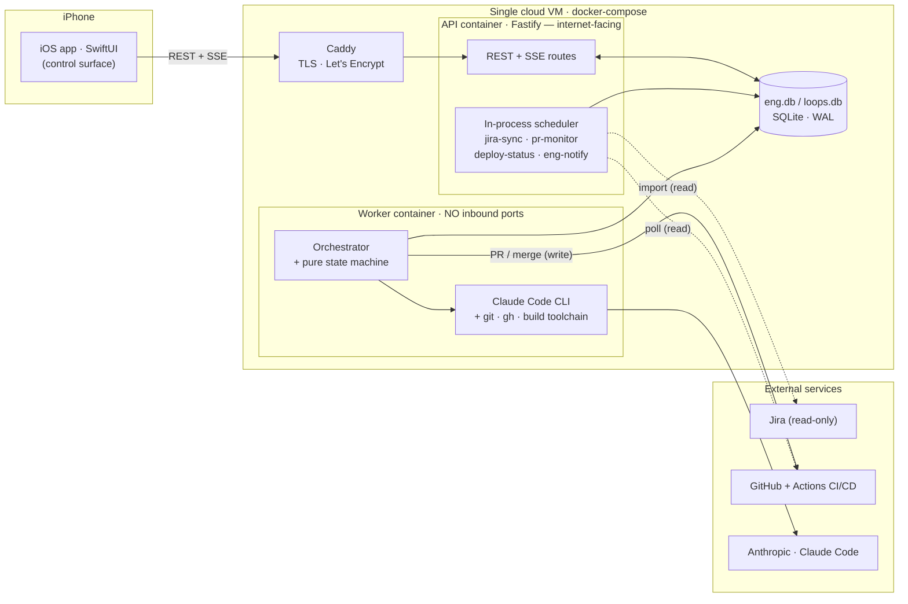

# LoopKeeper

> **Nothing slips — and the busywork ships itself.**

LoopKeeper is a **single-user, phone-first** system with two cooperating halves:

1. **Open-loops** — captures every commitment, request and deadline from **Slack + Gmail** into one list of *open loops* (with the actual words said and the real due date) and nudges you before any of them slips.
2. **Engineering pipeline** — turns your phone into a control surface that drives Jira tickets through a full **plan → dev → test → PR → review → merge → deploy → verify** software-delivery pipeline, executed by a headless **[Claude Code](https://claude.com/claude-code)** agent on a cloud VM, with a human approval gate at every irreversible step.

[](./LICENSE)


---

## Table of contents

- [What it is](#what-it-is)
- [How LoopKeeper uses Claude Code](#how-loopkeeper-uses-claude-code)
- [Architecture at a glance](#architecture-at-a-glance)
- [Repository layout](#repository-layout)
- [Prerequisites](#prerequisites)
- [Quickstart (local dev)](#quickstart-local-dev)
- [Running the engineering worker](#running-the-engineering-worker)
- [iOS app](#ios-app)
- [Configuration reference](#configuration-reference)
- [Connectors & integrations](#connectors--integrations)
- [Production deployment](#production-deployment)
- [CI/CD](#cicd)
- [Tooling & conventions](#tooling--conventions)
- [Security & privacy](#security--privacy)
- [Documentation](#documentation)
- [Contributing](#contributing)
- [License](#license)

---

## What it is

There is exactly one operator. The iOS app is not a dashboard — it's a **control surface**: every consequential decision is a tap on your phone, and everything in between is automated.

**The open-loops half** ingests Slack + Gmail (read-only OAuth), uses an LLM to extract *commitments / requests / deadlines* with a redacted, minimal-retention footprint, and reminds you before they slip. False-positive nudge fatigue is treated as the category killer, so extraction precision and secret-redaction come first.

**The engineering half** reads a Jira issue and lets a Claude Code agent write an approvable plan, implement it on an isolated git worktree, run the test suite and fix its own failures, open the pull request, address review comments, and — after a merge it is never allowed to perform itself — watch CI/CD and fix-forward a broken build. You own the decisions that matter (which plan ships, whether to open the PR, whether to merge, whether the deploy is good); the agent owns the labor.

| | Open-loops pipeline | Engineering pipeline |
|---|---|---|
| **Trigger** | Slack/Gmail messages | Jira issues (read-only import) |
| **LLM** | Raw Anthropic Messages API / OpenAI (classification) | **Claude Code CLI** (headless agentic coding) |
| **Store** | `loops.db` | `eng.db` |
| **Output** | Reminders / nudges / suggested reply drafts | Plans, PRs, merges, deploys — behind human gates |

> Both are single-user and local-first-ish: SQLite, no external database, secret-shaped values redacted before any write.

---

## How LoopKeeper uses Claude Code

The engineering pipeline is driven entirely by **Claude Code invoked headless**, one subprocess per stage. This is a deliberately small, auditable slice of the CLI surface — the interesting engineering is as much in what is *not* used as what is.

```
claude -p --output-format stream-json --verbose \
  (--session-id <uuid> | --resume <uuid>) \
  --permission-mode (plan | acceptEdits) \
  [--model <model>] \
  "<prompt>"
```

- **Headless print mode** (`-p`) with **`stream-json`** parsed line-by-line for tool calls, the plan, cost and turns.
- **Sessions assigned up front** (`--session-id`) so they're crash-proof; dev/review **`--resume`** them, with a **cold-start fallback** that re-injects the plan + branch log if a resume fails.
- **`--permission-mode plan` vs `acceptEdits`** is the safety spine: read-only planning (plan captured via the `ExitPlanMode` tool) vs. autonomous editing — paired with human approval gates so the agent **never authors *and* merges**.
- **Model allow-list**, per-task override, and a cheap **Haiku-pinned LLM-as-judge** that scores plan quality inline in the notification.
- **Defense-in-depth blast-radius controls**: minimal non-inherited env (no prod secrets, no deploy key), worktree-scoped cwd, a repo-scoped GitHub token, a pinned CLI version, and a detached process-group kill for cancel/timeout.
- Deliberately **not** used: `--allowedTools` (broke `--resume` on the pinned CLI), `--dangerously-skip-permissions`, MCP servers, subagents, hooks, slash commands, a custom system prompt, or the Agent SDK — a raw CLI subprocess keeps argv/env/process-group fully under LoopKeeper's control.

**Read the full breakdown** (invocation, feature-usage table, per-stage prompts, session discipline, output handling, model policy, safety controls) in **[LoopKeeper-Engineering-Technical-Architecture.md § 6](./LoopKeeper-Engineering-Technical-Architecture.md#6-how-loopkeeper-uses-claude-code)**.

---

## Architecture at a glance

The single most important structural decision is the **api / worker process split**: the internet-facing API never holds the Claude token, the GitHub write token, or the deploy key, and is never one `spawn()` away from arbitrary code execution. All of that lives in a portless worker; the two processes communicate only through a shared SQLite job queue.



The engineering pipeline is a pure, unit-testable **state machine** with 9 stages, 3 mandatory approval gates (plan/PR/merge) plus 2 post-deploy confirmations (verify/rollback), a durable lease-based job queue, and a single compare-and-swap chokepoint for every state change. See the **[Technical Architecture](./LoopKeeper-Engineering-Technical-Architecture.md)** for the full state diagram, execution model, data model, and safety analysis, and the **[Engineering PRD](./LoopKeeper-Engineering-PRD.md)** for product requirements.

---

## Repository layout

```
loopkeeper/
├─ backend/                 @loopkeeper/backend — the only pnpm package (extraction engine, API, worker)
│  ├─ src/                  TypeScript sources (run directly in dev via --experimental-strip-types)
│  │  ├─ domain/            core types: open-loop, message, eng-task, source-config
│  │  ├─ engineering/       Phase-2 orchestration: orchestrator, state-machine, worker, prompts,
│  │  │  │                    pr-monitor, deploy-monitor, ports, factory
│  │  │  ├─ adapters/       claude-runner, git-workspace, rest-github, ssh-deployer, vitest-tester, spawn
│  │  │  └─ jira/           jira-client, jira-mapper, jira-sync (read-only)
│  │  ├─ store/             loops-store.ts, eng-store.ts (SQLite / better-sqlite3, WAL)
│  │  ├─ server/            Fastify app: server.ts, app.ts, config.ts, routes/
│  │  ├─ scan/ sources/     ingest → gate → extract → upsert; Slack/Gmail/fake source adapters
│  │  ├─ llm/ oauth/ vault/ provider abstraction, read-only OAuth flows, AES-256-GCM token vault
│  │  ├─ push/ nudge/       APNs client + nudge service
│  │  └─ scheduler/ draft/  in-process scan/nudge/purge jobs; suggested reply drafts
│  └─ test/                 vitest suites mirroring src/
├─ ios/                     native SwiftUI app; .xcodeproj generated from project.yml (XcodeGen)
├─ deploy/                  docker-compose (api + worker + caddy), Caddyfile, loopkeeper.env.example
├─ ops/                     redeploy.sh (forced command), serve.sh, Jira-seeding scripts
├─ .github/workflows/       ci.yml (PR gate), deploy.yml (CD on merge)
├─ Dockerfile               api image (node:22-bookworm-slim)
├─ Dockerfile.worker        worker image (adds git/gh/openssh + pinned claude-code)
└─ *.md                     README, LoopKeeper-Engineering-Technical-Architecture, PRD, ENGINEERING-SETUP,
                            MOBILE, AWS, SLACK-SETUP, CONTRIBUTING, SECURITY
```

---

## Prerequisites

| Tool | Version | Needed for |
|---|---|---|
| **Node.js** | `>=22` (22.6+ recommended — dev scripts run TS via `--experimental-strip-types`) | Everything backend |
| **pnpm** | `9.15.0` — run `corepack enable` to activate the pinned version | Workspace install/build |
| **C/C++ toolchain** | `python3`, `make`, `g++` (fallback for `better-sqlite3` prebuilds) | Native SQLite module |
| **git** | any recent | Worker clone / worktree / push |
| **GitHub CLI (`gh`)** | latest stable | Worker PR helpers (engineering pipeline) |
| **Claude Code CLI** | pinned **2.1.158** (`@anthropic-ai/claude-code`) | Engineering worker (runs the agent) |
| **Docker + Compose v2** | `docker compose` | Container deploy (api + worker + caddy) |
| **Xcode** | 26.x, Swift 6 · **XcodeGen** (`brew install xcodegen`) | iOS app (macOS only) |

> **Platform:** macOS is required for the iOS app. The backend/worker run on macOS or Linux; the shipped images are Debian (`node:22-bookworm-slim`).

---

## Quickstart (local dev)

```sh
git clone <repo-url> loopkeeper
cd loopkeeper
corepack enable            # activates the pinned pnpm@9.15.0
pnpm install
```

**Root scripts** fan out to every workspace package with `pnpm -r`:

```sh
pnpm build        # tsdown → dist/*.mjs
pnpm test         # vitest run
pnpm lint         # oxlint
pnpm typecheck    # tsc --noEmit (strict)
```

**Run the open-loops (product) pipeline** — deterministic offline stub, no key needed:

```sh
pnpm --filter @loopkeeper/backend phase0            # extraction report over fixtures (offline)
ANTHROPIC_API_KEY=sk-ant-... \
  node --experimental-strip-types backend/src/phase0.ts --live   # against the real model
```

**Run the API server:**

```sh
pnpm --filter @loopkeeper/backend dev              # watch mode → http://127.0.0.1:8787
# or a production-style run:
pnpm --filter @loopkeeper/backend build && pnpm --filter @loopkeeper/backend start
curl http://127.0.0.1:8787/healthz                 # → {"ok":true,...}
```

**Seed sample loops** (useful before pointing the iOS app at a local backend):

```sh
pnpm --filter @loopkeeper/backend seed
```

The **minimal** env to boot the API + product pipeline is a single LLM key — everything else defaults (`HOST=127.0.0.1`, `PORT=8787`, `~/.loopkeeper` data dir, auto-generated vault key, open/no-auth on localhost):

```sh
OPENAI_API_KEY=sk-...            # auto-selects the openai provider
# — or —
ANTHROPIC_API_KEY=sk-ant-...
LLM_PROVIDER=anthropic
```

---

## Running the engineering worker

The worker is a **separate process** from the API — it owns Claude Code, git branches, merges, and the deploy observer, and shares `eng.db` with the API (single writer, concurrency 1).

```sh
# dev (runs TS directly):
node --experimental-strip-types backend/src/worker/worker.ts
# or after a build:
node backend/dist/worker/worker.mjs
# → "[worker] started — polling eng.db every 15s (concurrency 1)"
```

To do real work the worker needs:

- **A repo** — `GITHUB_REPO=owner/name` + a fine-grained **`GITHUB_TOKEN`** PAT scoped to *only* that repo (Contents r/w, Pull requests r/w; `Actions: read` for the deploy observer).
- **Claude Code authenticated** — one of: subscription token `CLAUDE_CODE_OAUTH_TOKEN` (from `claude setup-token`, preferred), a prior `claude login` in `~/.claude`, or metered `ANTHROPIC_API_KEY`.
- **`git` + `gh`** on PATH and the `claude` CLI at `ENG_CLAUDE_BIN` (default `claude`).
- **Jira** as the task source — API-token path (`JIRA_BASE_URL` + `JIRA_EMAIL` + `JIRA_API_TOKEN`) or OAuth 3LO, plus `LOOPKEEPER_JIRA_ACCOUNT_ID` for the assignee gate.

Full worker + branch-protection + VM runbook: **[ENGINEERING-SETUP.md](./ENGINEERING-SETUP.md)**.

---

## iOS app

The Xcode project is **generated from `project.yml`** (XcodeGen) and is not committed, so it's reproducible.

```sh
brew install xcodegen               # one-time
cd ios && xcodegen generate         # writes Loopkeeper.xcodeproj
open Loopkeeper.xcodeproj            # then ⌘R on an iPhone simulator
# headless simulator build/boot:
bash run-sim.sh
```

- **Bundle id:** `com.curiescious.loopkeeper` · **Deployment target:** iOS 18.0 · **Swift:** 6 (strict concurrency).
- **Point the app at the backend** in the app's **Settings** screen: *Backend URL* (default `http://127.0.0.1:8787`; use your Mac's LAN IP or a tunnel from a physical phone) and the optional *API token* (matches `LOOPKEEPER_API_TOKEN`).
- **Install on a physical iPhone with a free Apple ID:** `bash ios/build-ipa.sh` → drop `Loopkeeper.ipa` into **Sideloadly** (re-signs, valid 7 days). Server-side APNs push + TestFlight require a paid Apple Developer account; without it, nudges are on-device local notifications.

More: **[MOBILE.md](./MOBILE.md)** · **[ios/README.md](./ios/README.md)**.

---

## Configuration reference

All settings are environment variables read by `backend/src/server/config.ts` (`loadConfig`). The production template is **[`deploy/loopkeeper.env.example`](./deploy/loopkeeper.env.example)**. Copy it to `deploy/loopkeeper.env` (gitignored) and fill in what you need.

### Essential

| Variable | Default | Purpose |
|---|---|---|
| `PORT` / `HOST` | `8787` / `127.0.0.1` | HTTP listen port / bind address (prod: `8080` / `0.0.0.0`). |
| `LOOPKEEPER_PUBLIC_URL` | `http://<host>:<port>` | Public base URL OAuth providers redirect back to — must match your redirect URIs exactly. |
| `LOOPKEEPER_DATA_DIR` | `~/.loopkeeper` | Root data dir for `loops.db`, `eng.db`, `tokens.enc`, master key (prod: `/data`). |
| `LOOPKEEPER_API_TOKEN` | *(unset = open)* | If set, app routes require `Authorization: Bearer <token>` (`/healthz` + `/auth/*` stay open). **Fails open** — set before any LAN/tunnel exposure. Generate `openssl rand -hex 24`. |
| `LOOPKEEPER_MASTER_KEY` | *(auto-gen)* | Base64 of 32 bytes for the AES-256-GCM token vault. **Keep stable forever** — changing it invalidates stored OAuth tokens. Generate `openssl rand -base64 32`. |
| `LLM_PROVIDER` | *(auto)* | `anthropic` \| `openai`. Auto-selects `openai` when `OPENAI_API_KEY` is present, else `anthropic`. |
| `ANTHROPIC_API_KEY` / `OPENAI_API_KEY` | *(null)* | Extraction/draft key for the chosen provider. |
| `LOOPKEEPER_TZ` | `Asia/Kolkata` | Timezone for due-date anchoring. |

<details>
<summary><b>Full environment reference</b> (product, connectors, engineering worker, deploy)</summary>

#### LLM & scheduling

| Variable | Default | Purpose |
|---|---|---|
| `OPENAI_MODEL` | `gpt-4o-mini` | OpenAI model for extraction/drafts. |
| `LOOPKEEPER_USER_NAME` | `Karna` | Identity display name (first-person owe-loop detection). |
| `LOOPKEEPER_USER_ALIASES` | `""` | Comma-separated aliases. |
| `LOOPKEEPER_SCAN_EVERY_MIN` | `120` | Auto-scan interval (min); `0` disables. |
| `LOOPKEEPER_NUDGE_EVERY_MIN` | `60` | Auto-nudge interval (min); `0` disables. |
| `LOOPKEEPER_TTL_DAYS` | `30` | Purge closed/dismissed loops older than this. |
| `LOOPKEEPER_INCLUDE_QUOTE` | off (`1`=on) | Persist a short verbatim commitment excerpt (third-party data). |
| `LOOPKEEPER_DB_PATH` / `LOOPKEEPER_VAULT_PATH` | `<dataDir>/loops.db` · `<dataDir>/tokens.enc` | Store & vault paths. |

#### Connectors

| Variable | Default | Purpose |
|---|---|---|
| `SLACK_CLIENT_ID` / `SLACK_CLIENT_SECRET` | null | Slack OAuth app (both required or connector is off). |
| `GOOGLE_CLIENT_ID` / `GOOGLE_CLIENT_SECRET` | null | Google/Gmail OAuth client (both required). |
| `JIRA_BASE_URL` / `JIRA_EMAIL` / `JIRA_API_TOKEN` | null | Jira API-token (Basic) auth — all three. |
| `JIRA_CLIENT_ID` / `JIRA_CLIENT_SECRET` | null | Jira OAuth 3LO (alternative to the token path). |
| `LOOPKEEPER_JIRA_ACCOUNT_ID` | null | Your Jira `accountId` — assignee-gate identity + `GET /tasks` filter (gates fail closed without it). |
| `LOOPKEEPER_JIRA_SYNC_EVERY_MIN` / `LOOPKEEPER_PR_POLL_EVERY_MIN` | `10` / `5` | Jira sync & PR-poll cadences (min); `0` disables. |
| `GITHUB_REPO` / `GITHUB_TOKEN` / `GITHUB_BASE_BRANCH` | null · null · `main` | Target repo, fine-grained PAT, base branch (engineering pipeline). |

#### Engineering worker (`ENG_*`) & Claude Code auth

| Variable | Default | Purpose |
|---|---|---|
| `ENG_ENABLED` | on (`0`=off) | Master toggle (still no-ops without Jira/GitHub/worker auth). |
| `ENG_DB_PATH` | `<dataDir>/eng.db` | Orchestration DB (stages, sessions, artifacts, jobs, budgets). |
| `ENG_REPO_URL` / `ENG_WORKTREE_ROOT` | derived · `<dataDir>/eng/worktrees` | Clone URL & worktrees root. |
| `ENG_CLAUDE_BIN` / `ENG_CLAUDE_MODEL` | `claude` · *(CLI default)* | Agent binary path & optional model override. |
| `ENG_MAX_ITERATIONS` | `6` | Per-task iteration cap. |
| `ENG_TASK_BUDGET_USD_CENTS` | `500` | Per-task USD-cent budget cap. |
| `ENG_MAX_REVIEW_ROUNDS` | `5` | Per-task review-round cap. |
| `ENG_RUN_TIMEOUT_MS` | `1200000` | Per-run wall-clock cap (20 min). |
| `ENG_MAX_CONCURRENT` | `1` | Max parallel tasks/worktrees. |
| `ENG_AGENT_LOG_DIR` | `<dataDir>/eng/agent-logs` | Redacted stream-json transcripts. |
| `ENG_GIT_AUTHOR_NAME` / `ENG_GIT_AUTHOR_EMAIL` | `LoopKeeper Bot` · `bot@loopkeeper.local` | Worker committer identity. |
| `ENG_JIRA_WRITEBACK` | off (`1`=on) | Opt-in Jira comment write-back. |
| `LOOPKEEPER_WORKER_POLL_SEC` | `15` | Worker job-poll cadence (sec). |
| `CLAUDE_CODE_OAUTH_TOKEN` | null | Subscription token (preferred) from `claude setup-token`. |

#### APNs push

`APNS_KEY_ID`, `APNS_TEAM_ID`, `APNS_BUNDLE_ID`, `APNS_KEY_P8` (PEM; literal `\n` accepted) — **all four** required or push is disabled. `APNS_ENV` = `production` for prod APNs (else sandbox).

#### Deploy

| Variable | Default | Purpose |
|---|---|---|
| `DEPLOY_ENABLED` | off (`1`=on) | Safety flag — deploy stage is a **no-op** until exactly `1`. |
| `DEPLOY_MODE` | `github-actions` | `github-actions` (Actions runs CD, app observes by SHA) or legacy `ssh`. |
| `DEPLOY_SSH_HOST` / `DEPLOY_SSH_USER` / `DEPLOY_SSH_KEY_PATH` | `""` · `deploy` · `""` | SSH target (ssh mode only). |
| `DEPLOY_REMOTE_PATH` / `DEPLOY_BRANCH` | `/opt/loopkeeper` · `main` | Remote dir & branch. |
| `DEPLOY_VERIFY_URL` | null | Prod URL smoke-checked post-deploy (e.g. `https://host/healthz`). |
| `LK_HOST` | *(required by compose)* | Public hostname for Caddy TLS (set in `deploy/.env`); should equal `LOOPKEEPER_PUBLIC_URL` minus the scheme. |

</details>

<details>
<summary><b>Fail-closed / feature-gating behavior</b></summary>

- `DEPLOY_ENABLED` ≠ `1` → deploy stage is a **no-op** regardless of mode.
- `LOOPKEEPER_JIRA_ACCOUNT_ID` unset → no assignee-gate identity and no `GET /tasks` filter (eng task list ungated/empty).
- Incomplete Jira creds (need all of BASE_URL+EMAIL+API_TOKEN, **or** both OAuth id+secret) → Jira disabled; `GET /tasks` returns **503** when eng isn't configured.
- `GITHUB_REPO` unset → engineering pipeline can't target a repo.
- Only one of a `SLACK_*` / `GOOGLE_*` / `JIRA_*` OAuth pair set → connector off (both required).
- Any of the four `APNS_*` missing → push disabled.
- Worker Claude auth absent → agent can't run (precedence: `CLAUDE_CODE_OAUTH_TOKEN` → `~/.claude` login → `ANTHROPIC_API_KEY`).
- ⚠️ **`LOOPKEEPER_API_TOKEN` unset fails _open_** — app routes are unauthenticated. Safe only on localhost.
- `LK_HOST` unset → `docker compose up` errors.

</details>

---

## Connectors & integrations

LoopKeeper requests **read-only scopes only**. OAuth apps are configured via env vars and connected by visiting `/auth/<provider>` in a browser; the callback lands the token in the encrypted vault. The redirect URL for every provider is `${LOOPKEEPER_PUBLIC_URL}/auth/<provider>/callback`.

| Provider | Create | Scopes | Env vars |
|---|---|---|---|
| **Slack** | Internal Slack app (do **not** enable public distribution) | `channels/groups/im/mpim:history`, `*:read`, `search:read`, `users:read` (no `files:read`) | `SLACK_CLIENT_ID`, `SLACK_CLIENT_SECRET` |
| **Google (Gmail)** | OAuth Web client; keep consent screen in *Testing* + add yourself | `gmail.readonly`, `openid`, `email` (offline access for a refresh token) | `GOOGLE_CLIENT_ID`, `GOOGLE_CLIENT_SECRET` |
| **Jira (recommended)** | API token at id.atlassian.com | Basic auth (no OAuth scopes) | `JIRA_BASE_URL`, `JIRA_EMAIL`, `JIRA_API_TOKEN` |
| **Jira (OAuth 3LO)** | Developer-console app; connect via `/auth/jira` | `read:jira-work`, `read:jira-user`, `offline_access` (read-only) | `JIRA_CLIENT_ID`, `JIRA_CLIENT_SECRET` |
| **GitHub** (worker) | Fine-grained PAT scoped to **only** the target repo | Contents r/w, Pull requests r/w, Actions read | `GITHUB_TOKEN`, `GITHUB_REPO` |

Slack setup detail: **[SLACK-SETUP.md](./SLACK-SETUP.md)**. Jira/GitHub setup detail: **[ENGINEERING-SETUP.md](./ENGINEERING-SETUP.md)**.

---

## Production deployment

The stack is three containers on a single VM: **`loopkeeper`** (API, internal `:8080`), **`worker`** (no inbound ports), and **`caddy`** (`:80`/`:443`, auto-HTTPS). Caddy issues a real Let's Encrypt cert for a **free `sslip.io` hostname** — no domain to buy.

```sh
# on the VM
sudo apt-get update && sudo apt-get install -y docker.io docker-compose-v2 git
sudo git clone <your-repo-url> /opt/loopkeeper
cd /opt/loopkeeper/deploy

cp .env.example .env                                 # set LK_HOST=<ip-with-dashes>.sslip.io
cp loopkeeper.env.example loopkeeper.env             # fill in secrets; chmod 600
sudo docker compose up -d --build                    # api + worker + caddy
curl https://<ip-with-dashes>.sslip.io/healthz       # → {"ok":true,...}
```

Minimum `loopkeeper.env` for the reminders app: `LOOPKEEPER_PUBLIC_URL=https://<host>`, a generated `LOOPKEEPER_API_TOKEN` and `LOOPKEEPER_MASTER_KEY`, one LLM key, and your OAuth client id/secret pairs — then set each provider's redirect URI to `https://<host>/auth/<provider>/callback` and visit `/auth/slack`, `/auth/google` to grant access.

- **Sizing:** ~1 GB is fine for the API alone; **upgrade to ≥4 GB (+ swap) if the engineering worker is enabled** (it runs `pnpm install`, `vitest`, and `claude`). Data lives in the `lk_data` Docker volume and survives restarts.
- **Update:** `git pull && docker compose up -d --build`.

Hosting walkthrough (AWS Lightsail + sslip.io): **[AWS.md](./AWS.md)**.

---

## CI/CD

- **PR gate — `.github/workflows/ci.yml`** (`on: pull_request → main`): `pnpm install --frozen-lockfile` → `typecheck` → `lint` → `test`. This is the status check `main` should require, and the check the agent's auto-opened PRs must pass.
- **CD on merge — `.github/workflows/deploy.yml`** (`on: push → main`): a `verify` job, then a `deploy` job (`environment: production`, `concurrency: deploy-main`, never cancels an in-flight deploy) that SSHes to the VM. The VM pins the deploy key to a **forced command** (`ops/redeploy.sh`), so SSH-ing in *is* the deploy and a leaked key can only redeploy merged `main`. Required Actions secrets: `DEPLOY_SSH_KEY`, `DEPLOY_USER`, `DEPLOY_HOST`.
- LoopKeeper **observes** the Actions run (by commit SHA) rather than deploying itself, so a CD run that restarts the app can't tear down its own deployer.
- **Branch protection** on `main`: require PRs + the `CI / verify` check, block direct pushes and force-pushes.

---

## Tooling & conventions

- **pnpm** 9.15.0 workspaces (one member: `backend`); root scripts recurse with `pnpm -r`.
- **Build:** `tsdown` → ESM `dist/*.mjs` + `.d.mts`. `"type": "module"`, ESM only.
- **Tests:** `vitest` under `backend/test/` mirroring `src/`.
- **Lint:** `oxlint`.
- **TypeScript strict** (from `tsconfig.base.json`): `strict`, `noUncheckedIndexedAccess`, `isolatedModules`, `verbatimModuleSyntax`, `NodeNext`, TS-extension imports. Conventions: no `any`, no `enum` (literal unions / `as const`), `node:` import prefixes, kebab-case module filenames.
- **Dev execution:** TypeScript runs directly via `node --experimental-strip-types` (Node 22.6+) — no separate transpile in dev.
- **Runtime deps:** `fastify`, `better-sqlite3`, `@anthropic-ai/sdk`, `openai`.

See **[CONTRIBUTING.md](./CONTRIBUTING.md)** for the full workflow, commit conventions, and PR checklist.

---

## Security & privacy

LoopKeeper is honest about its posture: it is **not** fully local-first — message bodies are processed by an LLM API on each scan, and structured loop metadata is persisted. It is **minimal-retention, redacted-metadata, per-user-isolated**:

- **Only structured metadata** is stored; secret-shaped values (`TOKEN`/`KEY`/`SECRET`/`ghp_`/`xoxb-`/private-key blocks/…) are **redacted before any DB write, before any text is sent to a model, and in agent logs**.
- **Counterpart quotes are opt-in** (`LOOPKEEPER_INCLUDE_QUOTE`) and off by default; closed loops are purged on a TTL.
- **OAuth tokens** live in an AES-256-GCM encrypted vault (`tokens.enc`) keyed by a local master key.
- **Read-only everywhere** — Slack/Gmail/Jira are read-only; engineering state is never written back to Jira (except an opt-in, DRAFT-first, human-approved comment).
- The engineering agent runs with a **minimal, non-inherited env** (no prod secrets, no deploy key), a **repo-scoped token**, worktree-scoped cwd, and **human gates on every irreversible action**.

Report vulnerabilities per **[SECURITY.md](./SECURITY.md)**.

---

## Documentation

| Doc | What it covers |
|---|---|
| **[LoopKeeper-Engineering-Technical-Architecture.md](./LoopKeeper-Engineering-Technical-Architecture.md)** | Deep dive: pipeline stages, state machine, execution model, **how Claude Code is used**, data model, live streaming, CI/CD, safety. |
| **[LoopKeeper-Engineering-PRD.md](./LoopKeeper-Engineering-PRD.md)** | Product requirements for the engineering pipeline (personas, FRs, gates). |
| **[ENGINEERING-SETUP.md](./ENGINEERING-SETUP.md)** | Worker / GitHub / Jira / VM setup runbook + safety properties. |
| **[MOBILE.md](./MOBILE.md)** | iPhone install + backend deploy runbook. |
| **[AWS.md](./AWS.md)** | AWS Lightsail + Caddy + sslip.io hosting. |
| **[SLACK-SETUP.md](./SLACK-SETUP.md)** | Slack app creation & scopes. |
| **[backend/README.md](./backend/README.md)** · **[ios/README.md](./ios/README.md)** | Package-level notes. |

---

## Contributing

Contributions are welcome — see **[CONTRIBUTING.md](./CONTRIBUTING.md)**. In short: Node 22 + `corepack enable`, `pnpm install`, and make sure `pnpm typecheck && pnpm lint && pnpm test` all pass before opening a PR. Conventional-commit messages; no direct pushes to `main`.

---

## License

[MIT](./LICENSE) © 2026 Sandip Ghane.

Built with [Claude Code](https://claude.com/claude-code).
